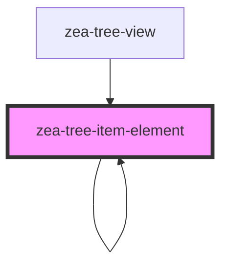

# zea-tree-item-element

<!-- Auto Generated Below -->

## Properties

| Property       | Attribute        | Description | Type      | Default        |
| -------------- | ---------------- | ----------- | --------- | -------------- |
| `arrow`        | `arrow`          |             | `string`  | `"►"`          |
| `expandOnLoad` | `expand-on-load` |             | `boolean` | `false`        |
| `isRoot`       | `is-root`        |             | `boolean` | `false`        |
| `label`        | `label`          |             | `string`  | `"Loading..."` |
| `treeItem`     | `tree-item`      |             | `any`     | `undefined`    |

## Dependencies

### Used by

 - [zea-tree-item-element]()
 - [zea-tree-view](../tree-view)

### Depends on

- [zea-tree-item-element]()

### Graph

----------------------------------------------

*Built with [StencilJS](https://stenciljs.com/)*
